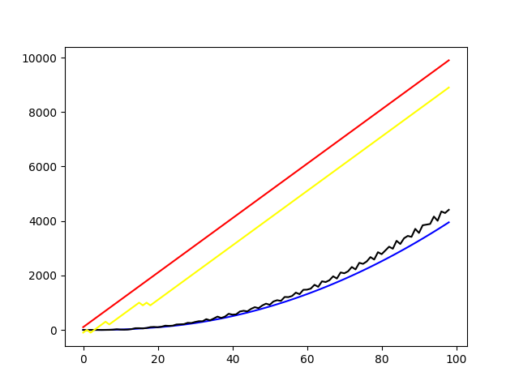
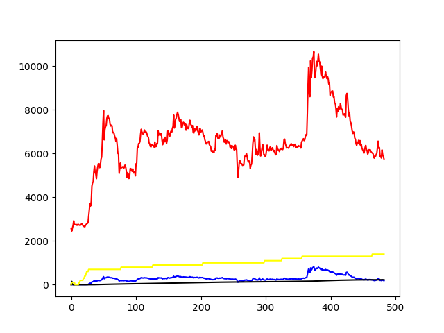

> 具体代码细节内容和介绍我放在我的博客中了：https://dvjiang.github.io/2022/07/01/%E5%88%A9%E7%94%A8%E5%BC%BA%E5%8C%96%E5%AD%A6%E4%B9%A0%E8%BF%9B%E8%A1%8C%E9%87%8F%E5%8C%96%E6%8A%95%E8%B5%84%E7%9A%84%E5%B0%9D%E8%AF%95/

设计特殊股票为直线上升时结果如下图：

其中红线为股价（放大过），黄线为系统的持股策略，蓝线为反馈的`reward`，黑线为C网络预测的价值走向。

可以看到，在简单情形下，系统可以做出正确的处理，成功预判并选择正确路径。

而选取股票代号为`000037`的股票时结果如下：

其中各颜色定义和前文相同，可以看到，蓝线代表的收益几乎始终为正，而黑线代表的C网络价值估计与蓝线最终重合。说明该系统可以完成部分正确的选择。

## 结论与展望

可以看到，赋予程序买卖的权力，而非只让它们预测股票的思路有一定的实际价值和应用前景，但它还需要更为精确的数据和改进，鉴于时间关系，本文只能对已经存在的问题和解决办法进行展望而无法实操。

该系统的问题首先在于C网络和实际`reward`的收敛性并不好，而当前系统的不稳定几乎全是因为C网络收敛失败造成的。本质原因在于股票的难以预测上，即：C网络本质上是在预测股票并评定价值，所以，在C网络种加入RNN乃至LSTM结构是必要的，增强它对连续数据的预测能力才能增强C网络预测`reward`的能力。

其次，在环境的设定上，每次只能买卖一股是一种理想而保守的情况，因此，将动作的选取从3选1调整为一个正态分布的随机抽取是合理的，而A输出的值决定着这个正态分布的参数，而通过正态分布抽取到的值将被作为买进或卖出的股票份额是更加符合实际的选择。

最后，在价值的评判上，单纯的以赚取的数目作为`reward`可能不是一个最好的选择，因为在一支一直上升的股票中，即使系统只买入了一点，其`reward`也会一直上升，也就是说，当系统选择保守但没有风险的策略时，也会一直受到鼓励，但过于保守将无钱可赚：系统可能选择“躺平”。因此，我们可以借鉴之前偏置的思路，使用一个参数来调整`reward`的阈值，使得没有赚到某个数目或者赚到能赚到的最高数目的一定比例时，激励为负。

使用“游戏”的方式研究股票的操作是一种罕见的视角，因为它不满足于传统的对股票的预测，而是加入对概率的考量，采用更为科学的视角观察股票。正如打牌时，仅仅知道各种情况的概率远远不够，能够根据这些条件做出判断更为重要。随着数据的积累和模型的优化，笔者认为利用机器学习完成股票预测将不是问题。
